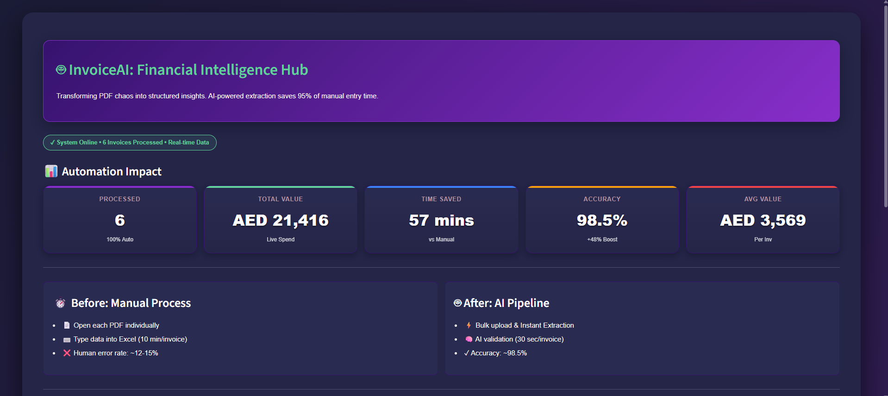
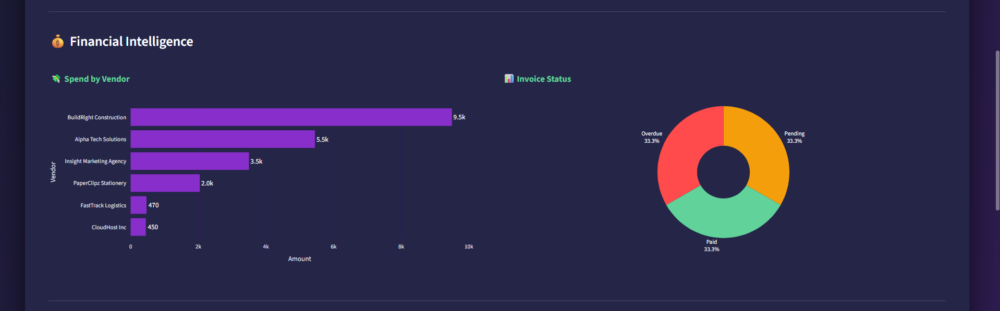
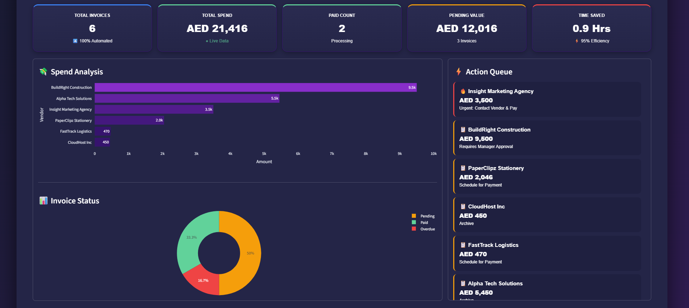

# 🤖 InvoiceAI — Automated Financial Intelligence Pipeline

> **From PDF chaos to structured financial insights in seconds.**  
> An AI-powered ETL pipeline that reduces manual invoice processing time by **~95%** and enables real-time spend visibility.


---

## 💼 Business Problem

Invoice processing remains a major operational bottleneck for SMEs and finance teams:

- **Time-intensive:** Processing a single invoice manually takes **10–15 minutes**
- **Error-prone:** Manual data entry has an estimated **12–15% error rate**
- **Low visibility:** Financial data remains locked inside unstructured PDF documents
- **Delayed decisions:** No real-time view of spend, liabilities, or overdue risk

This leads to delayed payments, compliance risk, and poor cash-flow planning.

---

## 💡 Solution Overview

**InvoiceAI** is an end-to-end **AI-driven financial intelligence system** that transforms raw PDF invoices into structured, actionable insights.

The system automates the entire workflow:

1. Ingest invoices
2. Extract structured data using LLMs
3. Apply business rules
4. Persist results
5. Visualize insights in an executive dashboard

---

## 🔄 Core Capabilities

### 📥 Invoice Ingestion

- Automatically detects digital PDF invoices from a designated directory
- Designed for batch processing at scale

### 🧠 AI-Powered Extraction

- Uses **Google Gemini 2.0** and **Longcat-560B (MoE)** for robust parsing
- Handles inconsistent layouts without rigid templates
- Outputs clean, structured JSON

### ⚡ Smart Action Engine

Applies business logic to every invoice:

- Flags **overdue payments**
- Identifies **high-value invoices**
- Assigns action labels such as:
  - `Urgent: Pay Immediately`
  - `Requires Manager Approval`
  - `Routine Payment`

### 🗄️ Data Persistence

- Stores normalized invoice data in **SQLite**
- Enables historical analysis, auditing, and reporting

### 📊 Executive Dashboard

- Power BI–inspired Streamlit interface
- Real-time KPIs, vendor analysis, and risk indicators
- Designed for finance managers and operations teams

---

## 📸 Dashboard Preview

>  >  > 

### 🎬 Video Preview

Watch a short walkthrough of InvoiceAI in action.

- Full demo (recorded video):  
  <video controls width="720">
    <source src="./assets/preview.mp4" type="video/mp4">
    Your browser does not support the video tag. You can download/watch it here: [Recording 2025-12-16 184959.mp4](./assets/preview.mp4)
  </video>

> 💡 Tip: Host the GIF in the repo under `assets/` or use a CDN/GitHub Pages for faster loading.

### Executive Overview

- Total spend
- Invoice volume
- Average invoice value
- Overdue alerts

### ⚡ Smart Action Center

- Critical issues highlighted in red
- Routine tasks grouped for operational clarity

---

## 🏗️ Technical Architecture


---

## 🚀 Quick Start

```bash
git clone https://github.com/YOUR_USERNAME/invoice-ai.git
cd invoice-ai
pip install -r requirements.txt
python scripts/init_db.py
python scripts/extract_ai.py
streamlit run scripts/dashboard.py
```

---

## 🧠 Key Design Decisions

### 🔁 Multi-Model AI Architecture

The extraction layer is designed to support multiple LLM providers. Models can be swapped (Gemini for speed, Longcat for long-context accuracy) without changes to downstream logic, reducing vendor lock-in risk.

### 🧩 Template-Free Parsing

Invoices are parsed using semantic understanding rather than rigid templates, allowing the system to handle diverse vendor layouts and formats.

### ⚡ Row-Level Intelligence

Each invoice is enriched with contextual metadata such as risk level and recommended action (e.g., _Urgent Payment_, _Manager Approval_), enabling operational decision-making rather than raw data display.

### 🛡️ Resilient ETL Pipeline

The extraction pipeline implements retry logic and exponential backoff to handle transient API failures and rate limits gracefully.

### 📊 Enterprise Dashboard Design

The Streamlit UI follows Power BI–inspired design principles:

- KPI-first layout
- High-contrast alerts for risk visibility
- Clean, executive-friendly typography and spacing

### 🗄️ Lightweight but Auditable Storage

SQLite is used for simplicity and portability while still supporting historical analysis, traceability, and audit requirements.

---

## 📍 Roadmap (v2.0)

The current MVP focuses on high-accuracy digital PDF extraction. Future planned updates include:

- Telegram Bot Integration: Upload invoices directly via chat using n8n webhooks.

- Vision OCR: Integration with pdf2image and GPT-4o Vision to support scanned paper receipts.

- Email Scraper: Auto-fetch invoices from a dedicated accounts@ email address.

- Docker Support: Full containerization for cloud deployment on Azure.

---

## 📬 Contact

Ubed Ullah
Data Scientist
[\[LinkedIn Profile\]](https://www.linkedin.com/in/ubedullah/)
[\[Github\]](https://github.com/Ubed-982)

```


