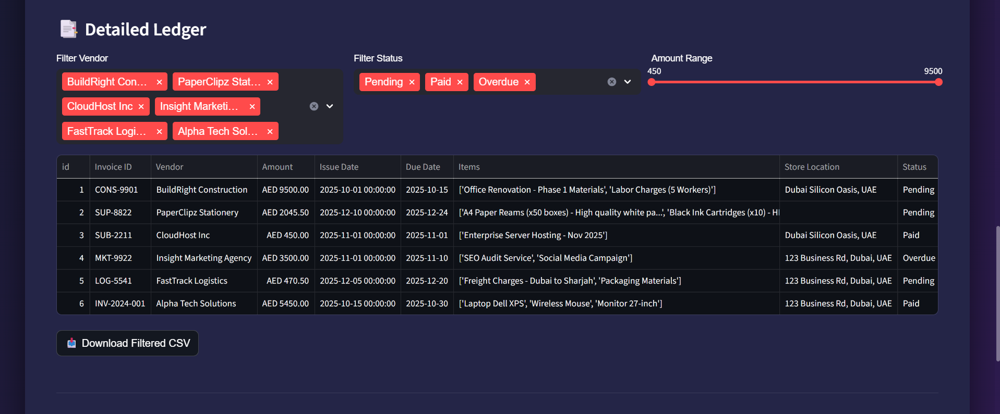
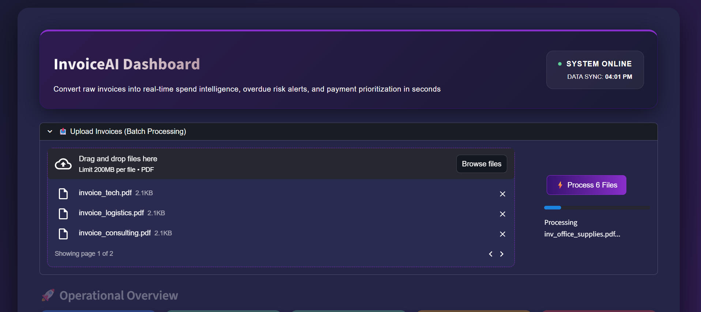

# 🤖 InvoiceAI — AI-Powered Invoice Intelligence Platform

Convert raw invoices into **real-time spend visibility, overdue risk alerts, and payment prioritization** — without manual processing.


---

## 🎯 Project Context — Built for UAE SMEs

InvoiceAI was designed to solve a real operational gap faced by small and mid-sized businesses across the UAE and MENA region.

Many finance teams still rely on manual invoice handling despite:
- VAT compliance requirements (5%)
- Multi-vendor invoice formats (English / Arabic)
- High invoice volumes with limited finance staff

This results in:
- 10–15 minutes lost per invoice
- Late payments and missed discounts
- No real-time visibility into liabilities or cash flow
- Critical data trapped inside PDFs

InvoiceAI acts as a **Financial Command Center**, bridging the gap between raw invoices and informed financial decisions.

---

## 💡 What InvoiceAI Does

InvoiceAI is an **end-to-end AI-driven invoice processing and analytics system** that transforms unstructured PDFs into structured, actionable intelligence.

### 🔄 End-to-End Workflow

1. Ingest PDF invoices (batch supported)
2. Extract structured data using LLMs
3. Apply business rules and risk logic
4. Persist normalized data
5. Visualize insights in a real-time dashboard

---

## 🚀 Key Features (v1.0 MVP)

### ⚡ AI-Powered Batch Processing
- Process 50+ invoices simultaneously
- Template-agnostic extraction across layouts
- Built-in validation to reduce extraction errors

### 🔥 Smart Action Queue
Invoices are automatically prioritized:
- Urgent: Overdue or high-value invoices
- Routine: Standard recurring payments
- Paid: Automatically archived

### 📊 Executive Dashboard
Power BI–inspired Streamlit interface:
- Spend KPIs and liability overview
- Overdue risk alerts
- Vendor-level analytics
- Exportable invoice ledger

### 🧠 Business-Aware Intelligence
Each invoice is enriched with:
- Risk classification
- Recommended next action
- Payment priority context

---

## 🎥 Product Walkthrough

A quick visual overview of how **InvoiceAI** transforms raw invoices into actionable financial intelligence.

---

### 📊 Dashboard Overview
*Real-time visibility into spend, liabilities, and invoice status.*


---

### ⚡ Smart Action Center
*LLM-driven prioritization of invoices based on urgency, value, and due dates.*




---

### 🎬 Live Demos

**End-to-End Invoice Processing**
> From raw PDF ingestion to structured data and dashboard updates.


**AI-Powered Action Recommendations**
> How the system reasons over invoices and suggests next actions.


## 🏗️ Technical Architecture


---

## 🧠 Key Design Decisions

- Multi-model AI architecture to reduce vendor lock-in
- Template-free parsing for layout flexibility
- Action-oriented enrichment for finance teams
- Resilient ETL with retry and backoff
- Enterprise dashboard design principles

---

## 🚀 Quick Start

```bash
git clone https://github.com/YOUR_USERNAME/invoice-ai.git
cd invoice-ai
pip install -r requirements.txt
python scripts/init_db.py
python scripts/extract_ai.py
streamlit run scripts/dashboard.py
```

---

## 🗺️ Roadmap (v2.0)

- WhatsApp / Telegram invoice ingestion
- Vision OCR for scanned documents
- Email inbox monitoring
- Dockerized Azure deployment
- PostgreSQL support

---

## 👤 About the Author

**Ubed Ullah**  
Data Scientist & AI Automation Engineer

🔗 LinkedIn: https://www.linkedin.com/in/ubedullah/  
💻 GitHub: https://github.com/Ubed-982

---

> InvoiceAI is a portfolio-grade project showcasing production-ready AI automation, data engineering, and financial analytics.
